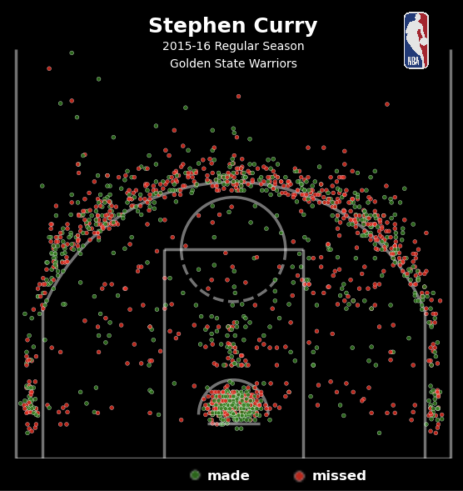

# Stephen Curry Shot Chart (2015–16 NBA Regular Season)

This project recreates a detailed shot chart for Stephen Curry’s iconic 2015–16 regular season using Python. The chart shows all made and missed field goal attempts using green and red dots, laid over a custom-drawn basketball court.

## What, Why, and How

I came across a beautiful visualization of Curry’s season on Reddit that was originally made in R. I wanted to challenge myself to recreate it from scratch using Python, even though it is not typically used for these types of basketball plots. This project gave me a chance to explore sports analytics and fine-tune my data visualization skills.

The biggest challenge was handling the coordinate transformations so that the shot locations aligned properly with the half-court layout. I also had to deal with rendering issues — the made/missed circles didn’t appear correctly, so I manually edited part of the final output to get the bubbles right.

I enjoyed working on this because it combined basketball, data, and design — three things I really enjoy. It also helped me understand how to reverse-engineer visualizations and improve technical accuracy using feedback and trial-and-error.

## Tools Used

- **Python** (Matplotlib for plotting, JSON data parsing)
- **Visual Studio Code**
- **Manual visual edits for final polish**

## Data Source

- NBA shot location data publicly available online (formatted as JSON)

## Key Takeaway

Even though this visualization was technically difficult to recreate in Python, I was able to learn a lot about coordinate mapping, graphic layering, and layout structure — all while working on something I care about.

---

Gytis Gervickas © 2025
