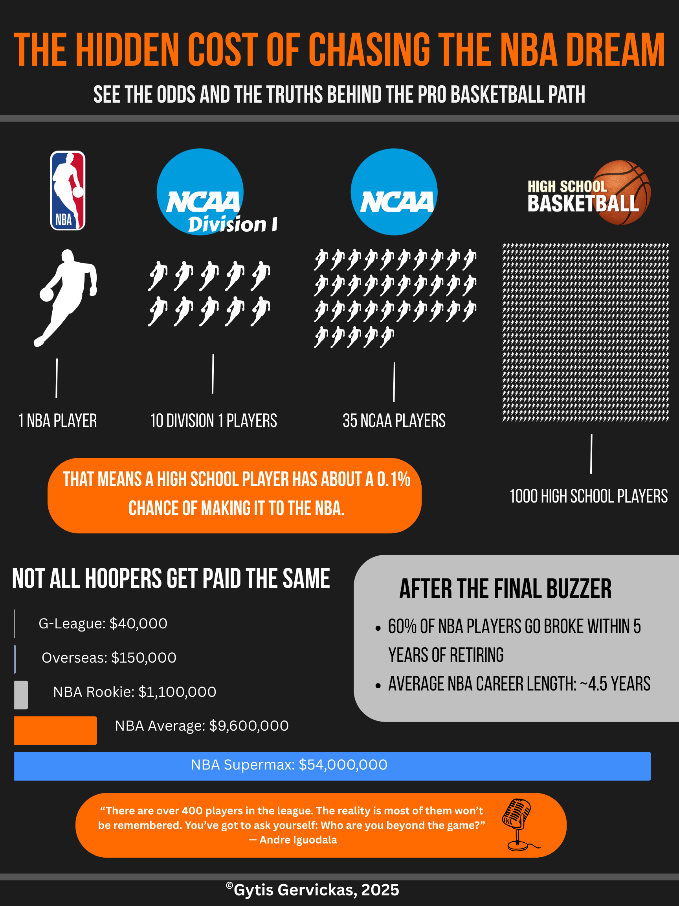

# After the Final Buzzer: The Hidden Cost of Chasing the NBA Dream

## Project Overview

This infographic visualizes the extremely low odds of making it to the NBA from high school, while also highlighting the financial and emotional realities of the professional basketball path. It aims to tell a compelling story through a combination of data, visuals, and quotes that resonate with young athletes and sports fans alike.

## What, Why, and How

The goal of this project was to break down the widely held dream of "making it to the league" using real data and simple visuals. I wanted to explore not just the chances of reaching the NBA, but also what life looks like afterward — including the risk of going broke and the short average career length. The quote from Andre Iguodala captures the deeper message: there’s more to life than just the game.

I created this infographic using Canva, and the process involved combining raw statistics, visual design, and storytelling. I worked through several layout ideas before settling on a pyramid design to show how few players reach the top.

## Tools Used

- **Canva** (for layout and design)
- **Excel** (for organizing statistics)
- **AI tools + professor feedback** (for refining concept and layout ideas)

## Data Sources

- NCAA Basketball Participation Report
- NBA Players Association estimates on career length and bankruptcy rates
- Public salary data for NBA, G-League, and overseas contracts

## Key Takeaway

While basketball can offer incredible opportunities, this project emphasizes the importance of understanding the odds and planning for life beyond the game.

---

Gytis Gervickas © 2025
