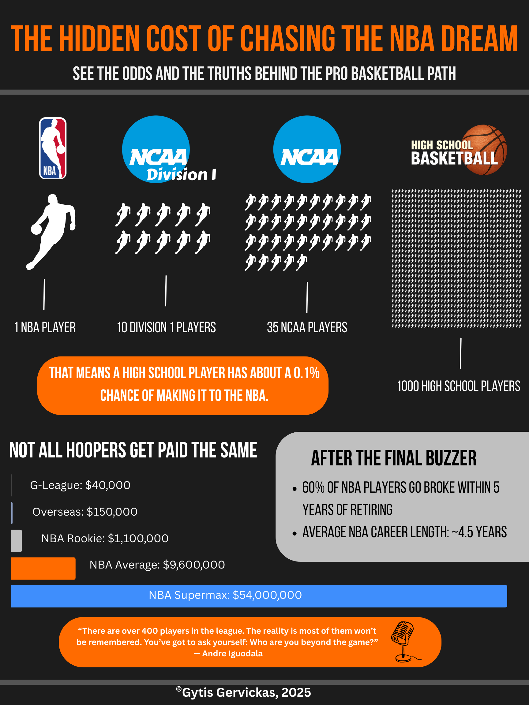

# Data Visualization Portfolio

## About Me
Hi, I'm Gytis Gervickas, a student at Gettysburg College majoring in Mathematical Economics and minoring in Data Science. I’m passionate about data, design, and storytelling, especially where they intersect with the world of sports and business. This portfolio showcases some of the projects I’ve worked on, including visualizations that explore basketball data and retail market analysis.

I enjoy transforming raw data into meaningful visuals, highlighting key insights. Whether it’s showing how few high school athletes make it to the NBA or analyzing grocery retail trends in the Baltics, I’m drawn to projects that combine analysis with strong visual communication.

<!--Include links to documents or sites that may be useful to your target audience: website, LinkedIn, your cv/resume, github, a community you contribute to, etc -->

To learn more about me, you can visit my [github](https://github.com/gervickas), or read my [CV](Images/CV.pdf).

---

## Project 1 Title

<table align="right | left" style = "border-collapse: collapse; border: none;">
    <tr style = "border: none;">
        <td style="padding: 10px; width:25%; border: none;"> 
            
        </td>
        <td style="padding:10px; width:75%; border: none;" valign = "top">
            

            Briefly describe the project, the motivation, and/or the goal.
            This project explores [brief description of the project]. I was inspired by [refer to inspiration]. The goal was to [objective of the project]. ... <a href="./Project 1/README.md">Learn more</a>
              
            <i>Tools used: Python, Pandas, Plotly, Canva</i>
            

        </td>
    </tr> 
</table>

## After the Final Buzzer: The Hidden Cost of Chasing the NBA Dream

<table align="center" style="border-collapse: collapse; border: none;">
  <tr style="border: none;">
    <td style="padding: 10px; width: 30%; border: none;">
      
    </td>
    <td style="padding: 10px; width: 70%; border: none;" valign="top">
      

        This infographic explores the tough reality behind the dream of making it to the NBA. Using a clear pyramid layout, 
        it shows how rare it is for a high school basketball player to reach the professional level — and what life looks like 
        beyond the game. From career length and salary data to financial struggles after retirement, this project highlights 
        the odds, risks, and truths behind chasing basketball success.
        <a href="./Project 2/README.md">Learn more</a>
          
        <i>Tools used: Canva, Excel, Markdown</i>
      

    </td>
  </tr>
</table>

## Project 3 Title
<table align="right | left" style = "border-collapse: collapse; border: none;">
    <tr style = "border: none;">
        <td style="padding: 10px; width:25%; border: none;"> 
            
        </td>
        <td style="padding:10px; width:75%; border: none;" valign = "top">
            

            Briefly describe Project 3   
            Lorem ipsum dolor sit amet, consectetur adipiscing elit, sed do eiusmod tempor incididunt ut labore et dolore magna aliqua. Ut enim ad minim veniam, quis nostrud exercitation ullamco laboris nisi ut aliquip ex ea commodo consequat. Duis aute irure dolor in reprehenderit in voluptate velit esse cillum dolore eu fugiat nulla pariatur. Excepteur sint occaecat cupidatat non proident, sunt in culpa qui officia deserunt mollit anim id est laborum... <a href="./Project 3/README.md">Learn more</a>
              
            <i>Tools used: Canva, Recraft</i>
            

        </td>
    </tr> 
</table>
