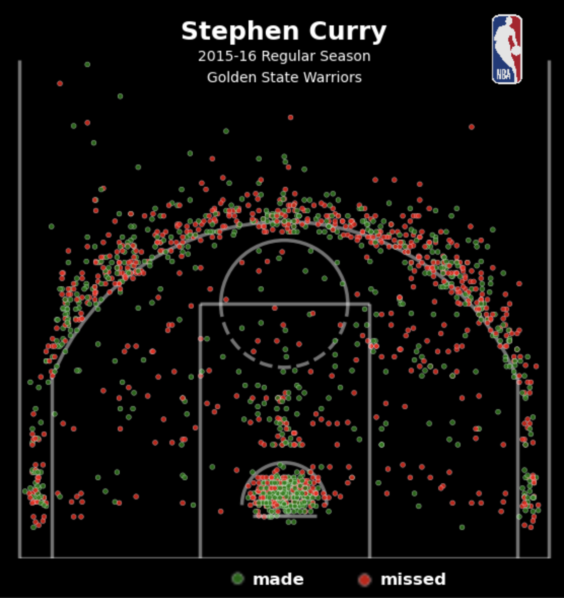
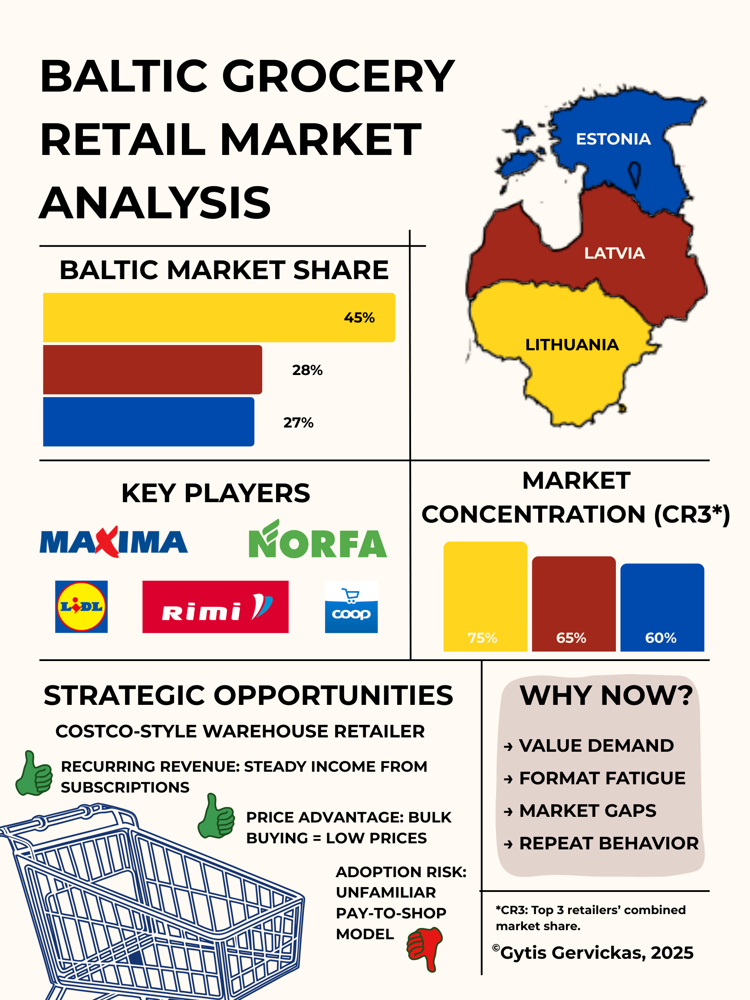

# Data Visualization Portfolio

## About Me
Hi, I'm Gytis Gervickas, a student at Gettysburg College majoring in Mathematical Economics and minoring in Data Science. I’m passionate about data, design, and storytelling, especially where they intersect with the world of sports and business. This portfolio showcases some of the projects I’ve worked on, including visualizations that explore basketball data and retail market analysis.

I enjoy transforming raw data into meaningful visuals, highlighting key insights. Whether it’s showing how few high school athletes make it to the NBA or analyzing grocery retail trends in the Baltics, I’m drawn to projects that combine analysis with strong visual communication.

<!--Include links to documents or sites that may be useful to your target audience: website, LinkedIn, your cv/resume, github, a community you contribute to, etc -->

To learn more about me, you can visit my [github](https://github.com/gervickas), or read my [CV](Images/CV.pdf).

---

## Stephen Curry Shot Chart (2015–16 Season)

<table align="center" style="border-collapse: collapse; border: none;">
  <tr style="border: none;">
    <td style="padding: 10px; width: 30%; border: none;">
      
    </td>
    <td style="padding: 10px; width: 70%; border: none;" valign="top">
      

        This project visualizes every made and missed shot by Stephen Curry during the 2015–16 NBA regular season. 
        Inspired by a chart originally found on Reddit and created in R, I recreated the entire graphic using Python, 
        manually transforming the shot location data and tweaking the layout for clarity and accuracy.
        <a href="./Project 1/README.md">Learn more</a>
          
        <i>Tools used: Python (Matplotlib), JSON data, VS Code</i>
      

    </td>
  </tr>
</table>

## After the Final Buzzer: The Hidden Cost of Chasing the NBA Dream

<table align="center" style="border-collapse: collapse; border: none;">
  <tr style="border: none;">
    <td style="padding: 10px; width: 30%; border: none;">
      
    </td>
    <td style="padding: 10px; width: 70%; border: none;" valign="top">
      

        This infographic explores the tough reality behind the dream of making it to the NBA. Using a clear pyramid layout, 
        it shows how rare it is for a high school basketball player to reach the professional level — and what life looks like 
        beyond the game. From career length and salary data to financial struggles after retirement, this project highlights 
        the odds, risks, and truths behind chasing basketball success.
        <a href="./Project 2/README.md">Learn more</a>
          
        <i>Tools used: Canva, Excel</i>
      

    </td>
  </tr>
</table>

## Baltic Grocery Retail Market Analysis

<table align="center" style="border-collapse: collapse; border: none;">
  <tr style="border: none;">
    <td style="padding: 10px; width: 30%; border: none;">
      
    </td>
    <td style="padding: 10px; width: 70%; border: none;" valign="top">
      

        This project analyzes the grocery retail market in Lithuania, Latvia, and Estonia. It explores market dynamics, 
        concentration, trends, and strategic opportunities. Built from my internship case study, this analysis highlights 
        potential investments such as a Costco-style model, rural consolidation, and e-commerce growth.
        <a href="./Project 3/README.md">Learn more</a>
          
        <i>Tools used: Canva, PowerPoint, Excel, market research reports</i>
      

    </td>
  </tr>
</table>

